# 🚀 Company RAG Assistant

A Retrieval-Augmented Generation (RAG) application that answers company policy and HR-related questions using semantic search, vector embeddings, and Large Language Models.

Users can upload company policy documents and ask questions in natural language to receive context-aware answers.

## 🎥 Demo


## 🔄 RAG Workflow



---

# ✨ Features

### 📄 Document Processing

* Upload company policy PDF documents
* PDF parsing using LangChain PDF Loader
* Automatic text chunking
* Chunk overlap for context preservation

### 🧠 Retrieval-Augmented Generation (RAG)

* Semantic document retrieval
* Similarity search using vector embeddings
* Context-aware answer generation
* Retrieval of relevant document chunks

### 🔍 Vector Search

* Ollama Embeddings (`all-minilm`)
* Pinecone Vector Database
* Cosine similarity search
* Fast retrieval of relevant information

### 🤖 AI Assistant

* Groq LLM integration
* Natural language question answering
* Company policy assistance
* HR knowledge base chatbot

### 💬 Chat Interface

* Clean React-based UI
* Real-time conversation experience
* Suggested policy questions
* Markdown response rendering

---

# 📂 Project Structure

```bash
company-rag-assistant
│
├── frontend/
│   ├── src/
│   ├── public/
│   └── package.json
│
├── chat.js
├── rag.js
├── prepare.js
├── package.json
├── README.md
└── .env
```

---

# ⚙️ Tech Stack

### Frontend

* React
* JavaScript
* React Markdown

### Backend

* Node.js
* Express.js

### AI & RAG

* LangChain
* Groq LLM
* Ollama Embeddings
* Pinecone Vector Database

### Document Processing

* PDF Loader
* Recursive Character Text Splitter

---

# 🔄 RAG Workflow

```text
PDF Document
      ↓
PDF Loader
      ↓
Text Chunking
      ↓
Ollama Embeddings
      ↓
Pinecone Vector Database
      ↓
Similarity Search
      ↓
Relevant Chunks Retrieved
      ↓
Groq LLM
      ↓
Final Answer
```

---

# 📌 Example Questions

* How many sick leaves are provided?
* What is the notice period?
* How does the promotion policy work?
* What is the annual learning budget?
* Can employees work remotely?
* What is the health insurance coverage?

---

# 🔑 Environment Variables

```env
PINECONE_API_KEY=
PINECONE_INDEX_NAME=
GROQ_API_KEY=
```

---

# 🚀 Installation

```bash
git clone https://github.com/iamshivansh2002/company-rag-assistant.git

cd company-rag-assistant

bun install
```

---

# 📥 Index Documents

```bash
bun rag.js
```

---

# ▶️ Run Application

```bash
bun chat.js
```

---

# 🎯 Key Concepts Demonstrated

* Retrieval-Augmented Generation (RAG)
* Vector Embeddings
* Semantic Search
* Similarity Search
* Vector Databases
* PDF Processing
* Context-Aware Question Answering
* LLM Integration

---

# 📄 License

This project is created for learning and portfolio purposes.
